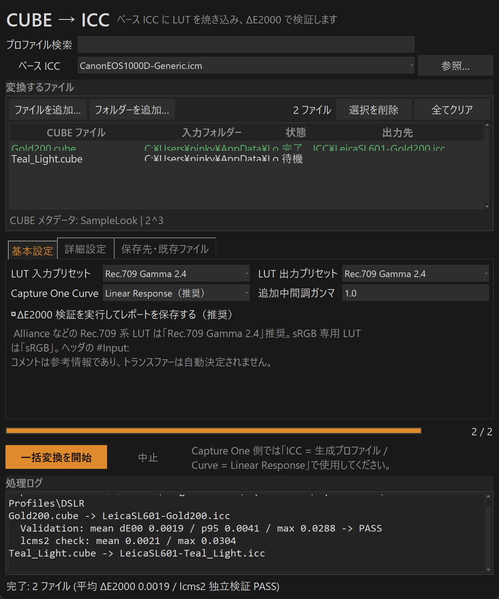

# C-One LUT — 計測可能な CUBE → ICC 変換

`.cube` 3D LUT を Capture Oneのカメラプロファイルとして扱える形式のiccファイルへと変換を行うスタンドアロンの Windows アプリです。
カメラプロファイルごとの設定を保持しながら変換できるため、色再現性が高いのが特徴です。

```
Camera RGB
   ↓  Base ICC の A2B タグを float 精度で評価 (8bit 量子化なし)
   ↓  正しい LUT 入力エンコーディング (色域とトランスファーは独立指定)
   ↓  元の creative LUT (native グリッドで四面体補間)
   ↓  正しい LUT 出力エンコーディング
   ↓  XYZ (D50, 明示的色順応) → PCS (Lab / XYZ はベースのヘッダに追従)
Capture One  (Curve = Linear Response)
```

生成した ICC が元の LUT とどれだけ一致するかを **ΔE2000 レポート** として数値で出力します。

## 設計の要点

| 項目 | 実装 |
| --- | --- |
| PCS / CLUT 整合 | ベース ICC ヘッダの PCS (`Lab `/`XYZ `) を判定し一致させる |
| 16bit Lab エンコード | ICC 規格の正規 legacy エンコード (L\*=100 → 0xFF00) |
| Profile ID | ICC 規定の MD5 を再計算して書き込み |
| A2B intent | `--icc-intent` でサンプリングと書き込み先を一致 (perceptual / relative / saturation / **mirror**) |
| Base ICC サポート | mft2 / mAB を **float64** で直接評価、matrix-shaper 型 (`rXYZ`/`gTRC`) も可、ネイティブlcms2バックエンドも選択可 |
| CUBE パーサー | DOMAIN_MIN/MAX、1D shaper、厳密な検証 (行数・NaN・不明ディレクティブ) |
| LUT 評価 | native グリッドのまま**四面体補間** (リサンプルなし) |
| Rec.709 と sRGB | 色域とトランスファーを分離 (`Rec.709 Gamma 2.4` / `sRGB` / `Rec.709 OETF` / `BT.1886` / Log 系) |
| ガンマ補正 | `--midtone-gamma`。1.0 = 補正なし |
| 検証 | 書き出した ICC ファイルを実測する **ΔE2000 レポート** (mean / median / p95 / p99 / max + 領域別) |
| レポート | **変換回ごとに 1 つの集計 JSON** (GUI・CLI共通)。詳細はファイル単位でオプトイン |

## 使い方 (CLI)

```powershell
python main.py LC_Spectra_Alliance.cube `
  --base-icc LeicaSL-Generic.icc `
  --input-gamut "ITU-R BT.709" --input-transfer "Gamma 2.4" `
  --output-gamut "ITU-R BT.709" --output-transfer "Gamma 2.4" `
  --midtone-gamma 1.0 `
  --lut-interpolation tetrahedral --icc-grid 33 `
  --icc-intent perceptual --validate
```

出力:

```text
LeicaSL601-LC_Alliance.icc
COneLUT-run-20260919-101239.json   ← この変換回の集計レポート 1 ファイル
```

出力ファイル名は `<カメラ名>-<LUT名>.icc` 形式 (Capture One 純正プロファイルと同じ命名規則) です。カメラ名はベース ICC の desc/ファイル名から、LUT名は CUBE のファイル名から取ります。

### カメラとの紐づけ（desc モード）

Capture One のプロファイル一覧に表示される名前は **ICC 内部の `desc` タグ**で、ファイル名ではありません。Capture One はこの文字列でカメラプロファイルとの紐づけを行うため、既定 (`--desc-mode base`) では **ベース ICC の desc をそのまま継承**します（例: `FujiXT5-Generic`）。この場合、リスト上の表示名はベースと同一になりますが、ファイル名で Look を区別できます。

Look ごとに別々の名前で表示したい場合は `--desc-mode look` を指定すると、`<カメラ名>-<LUT名>`（例: `FujiXT5-Gold200`）で desc を書きます。GUI では詳細設定タブの「プロファイル名（desc）」で切り替えられます。

| オプション | 内容・既定値 |
| --- | --- |
| `--base-icc` | 必須。カメラの ICC / ICM (Capture One のプロファイルを推奨) |
| `--input-gamut` / `--input-transfer` | LUT の入力色域 / トランスファー。既定 `sRGB` / `sRGB` |
| `--output-gamut` / `--output-transfer` | LUT の出力色域 / トランスファー。既定は入力と同じ |
| `--preset` | 入出力をまとめて設定する簡易プリセット (`Rec.709 Gamma 2.4`, `sRGB`, `Rec.709 OETF`, `BT.1886`, `ARRI LogC3/4`, `Sony S-Log3`, `Fujifilm F-Log/F-Log2`, `Panasonic V-Log` など) |
| `--midtone-gamma` | 追加の中間調補正。既定 `1.0` (補正なし) |
| `--desc-mode` | `base` (既定・ベースICCのdescを継承してカメラ紐づけを維持) / `look` (`カメラ名-LUT名` で表示を区別) |
| `--lut-interpolation` | `tetrahedral` (既定) / `trilinear` / `nearest` |
| `--icc-grid` | 17 / 33 (既定) / 49 / 65。33 以外の Capture One 互換性は要実機確認 |
| `--icc-intent` | `perceptual` (既定) / `relative` / `saturation` / `mirror` (A2B0 と A2B1 に同じ Look) |
| `--cat` | 色順応手法。既定 `Bradford` |
| `--domain-policy` | DOMAIN 外入力: `clamp` (既定) / `error` / `extrapolate`。クランプ率はレポートに記録 |
| `--lut-domain-policy` | CLUT ドメイン外: `clamp` / `error` |
| `--cms-precision` | `float` (既定) / `lcms` (ネイティブlcms2) |
| `--validate` | ΔE2000 検証を実行 (ネイティブlcms2による独立検証を含む) |
| `--validation-samples` | ランダム検証サンプル数 (既定 100000、固定シードで再現可能)。`0` で格子点のみ |
| `--run-report PATH` | 変換回の集計レポートの保存先 (既定は最初の出力の横に `COneLUT-run-<日時>.json`)。`--no-run-report` で無効化 |
| `--per-file-json` | ファイルごとの詳細 `.validation.json` も出力 (既定はオフ。`--report-json PATH` で単一ファイルの詳細レポート先を指定) |
| `--output-dir` / `--existing` | 保存先 / `rename` `skip` `overwrite` (CLI 既定は `overwrite`) |
| `--grid-policy auto` | ICCグリッドを `--icc-grid` から 33→49→65 へ昇格し、パイロット検証が `--auto-max-mean`/`--auto-max-p95` (既定 0.05/0.25) を満たす最小サイズを選択。最大値は参考扱い |
| `--input-shaper` | 誤差加重の入力カーブ (mft2入力テーブル) で格子を急峻領域へ再配分。LUTごとにパイロットA/Bで改善する場合のみ採用 |
| `--node-optimize` | 実験的: 格子点の値を微調整してノード間誤差を削減。独立サンプルで改善した場合のみ適用、悪化すれば元に戻す |
| `--probe-intent OUT.icc` | Capture One がどの A2B タグを使うか調べるプローブ ICC を生成 |

## 精度ストラテジー

既定では ICC CLUT は 33³ (Capture One 純正プロファイルと同じ仕様) に一様グリッドで焼き込みます。3 つの精度オプションが追加できます (GUI では詳細設定タブ):

- **グリッド自動選択** (`--grid-policy auto`): 33→49→65 とパイロット検証 (小規模サンプル) しながら昇格し、平均/P95 が基準 (既定 平均≤0.05 / P95≤0.25) を満たした時点で採用。実測では Alliance は 65³ で平均 0.037 / lcms2独立 0.014 に到達します。経過はログと実行レポートの `grid_ladder` に記録されます
- **入力シェーパー** (`--input-shaper`): まず等間隔で生成して誤差分布を測定し、誤差が大きい入力領域へ格子点を寄せた mft2 入力カーブを導出します。急峻な Look (HighContrast 系) では平均 5%超・P95 10%超の改善が出ますが、緩い Look では逆効果になるため、**パイロットA/B比較で改善した場合のみ採用**します (レポートの `input_shaper` に採否を記録)
- **格子点値の最適化** (`--node-optimize`, 実験的): ノード間の誤差を見ながら格子点の値を減衰補正します。学習サンプルとは別シードの独立サンプルで改善が確認できた反復のみ採用し、一度も改善しなければ元の値をそのまま書き出します

検証レポートには**誤差の居場所の診断** (`metrics_by_input_luminance`: 入力輝度 5 区画別の誤差) が含まれ、シャドウ集中かハイライト分散かが分かります。

## 実機での検証プロトコル

ΔE2000 検証は「ICC がリファレンス経路を再現していること」の証明であり、**Capture One の実際のレンダリングと一致することの証明ではありません** (C1 側の補間・レンダリングは検証の外側です)。実運用前に次を一度通すことを推奨します:

1. **表示確認**: 生成 ICC をインストールし、C1 のカメラプロファイル一覧に出る・適用できる・グラデーションに banding やグレーの色付きがないことを確認 (テストチャート: 下記)
2. **Linear Response での A/B**: 同じ RAW のバリアントを 2 つ (ベースプロファイル / 生成プロファイル + Curve = Linear Response) で現像し、LUT 適用済みの想定見た目と比較
3. **色がおかしい場合**: `--probe-intent` で C1 が使う A2B タグを特定し、`--icc-intent` (または `mirror`) を調整

テストチャート生成 (リファレンス見た目の PNG を出力):

```powershell
python tools\make_test_chart.py --base-icc LeicaSL-Generic.icm --lut Alliance.cube `
  --preset "Rec.709 Gamma 2.4" --out chart --icc LeicaSL-Alliance.icc
```

`chart_input.png` (入力チャート) / `chart_expected.png` (リファレンスの想定見た目) / `chart_icc.png` (生成 ICC による描画 + 差分統計) が出力されます。49³/65³ を初めて使うときもこの手順で実機確認してください。

## 保存の保護とベースプロファイルの対応

- **ベース ICC と入力 CUBE は決して上書きしません**。出力ファイル名がこれらと一致する場合(相対パス・大文字小文字の違い・ハードリンク等も含めて同一性判定)、`--existing` の設定に関係なく自動的に別名で保存します。検証レポート (実行レポート・`--report-json`) の保存先も同じ保護を受けます
- **Capture One へのコピー (GUI のインストール先コピー) も同じ保護と衝突ポリシー** を引き継ぎます。コピー先にベース ICC と同名のファイルがある場合は置き換えません
- 同一バッチ内で同名になる複数の結果 (別フォルダーの同名 CUBE など) は自動的に別ファイルとして保存され、互いに上書きしません
- `--existing overwrite` は保護対象・バッチ内先行結果以外の既存ファイルに対してのみ上書きします (GUI の「既存ファイルを上書き」も同様)
- ファイルは一時ファイル経由の**アトミックな書き込み**で公開されるため、変換中の中断で壊れた ICC が残りません
- ベース ICC は A2B タグを持つカメラプロファイル(推奨)に加え、**matrix-shaper 型**(`rXYZ`/`gTRC` 構成の通常の sRGB.icc など)も読めます。標準の `curveType` (32bit 要素数) と全ての `parametricCurveType` 形式、v4 の `mAB` 構造に対応しています

### Capture One が使う A2B タグを実測する

```powershell
python main.py --probe-intent probe.icc
```

`probe.icc` を Capture One でカメラ ICC として選び、赤寄り / 緑寄り / 青寄りのどれで表示されるかを確認します。結果に応じて `--icc-intent` を選択してください。確証が得られるまでの実用解として `--icc-intent mirror` (A2B0 と A2B1 に同じ Look を書き込み) も用意しています。

## ΔE2000 検証レポート

`--validate` を付けると、書き出した ICC ファイルそのものを読み戻してリファレンス パスと比較します。判定は二段構えです:

1. **内蔵評価** (自前のfloatパーサ/補間): ランダムサンプル + 33³ 格子点の両方で誤差を測定
2. **独立検証** (ネイティブlcms2): ベース ICC と生成 ICC の**両方**を LittleCMS で評価してリファレンス経路を再構成し、内蔵実装と誤差を共有しない状態で比較。格子端点を含み、`near_gamut_boundary` 領域別統計も追加

### 変換回レポート (既定)

1 回の変換 (GUI の一括変換・CLI の 1 実行) ごとに、**集計 JSON が 1 ファイル**だけ出力されます。全ファイルの要点メトリクス (mean / median / p95 / p99 / max・lcms2 検証・判定) と、実行設定・全体統計 (成功/エラー数、最悪 mean/max、総合判定) を含みます:

```text
out/
├─ LeicaSL601-Gold200.icc
├─ LeicaSL601-Teal_Light.icc
└─ COneLUT-run-20260919-101239.json   ← この変換回の集計
```

```json
{
  "tool": "C-One LUT",
  "started_at": "2026-09-19T10:12:38",
  "settings": { "input_gamut": "ITU-R BT.709", "...": "..." },
  "totals": { "files": 2, "success": 2, "error": 0, "skipped": 0, "cancelled": 0 },
  "validation": {
    "validated": 2, "overall_status": "PASS",
    "worst_mean_dE2000": { "value": 0.0008, "cube": "look1.cube" },
    "worst_max_dE2000":  { "value": 0.0028, "cube": "look1.cube" }
  },
  "files": [
    { "cube": "look1.cube", "output_path": ".../LeicaSL601-look1.icc", "status": "success",
      "metrics_dE2000": { "mean": 0.0008, "p95": 0.0014, "max": 0.0028 },
      "lcms2_check": { "mean": 0.0008, "max": 0.0032 }, "validation_status": "PASS" }
  ]
}
```

CLI では `--run-report PATH` で保存先を指定、`--no-run-report` で無効化できます。

### ファイルごとの詳細レポート (オプトイン)

`--per-file-json` を付けると、従来の `<name>.validation.json` (領域別統計・ドメイン統計・サンプルシードなど全文) も各 ICC の横に出力します。CLI を単独で使った場合のコンソールには詳細ブロックが表示されます:

```text
Validation report
  Samples:        100000
  Mean dE00:      0.0292
  ...
  lcms2 check:    mean 0.0295 / max 0.7701
    neutrals / skin_like_hues / dark_tones / midtones / highlights / high_saturation / near_gamut_boundary
  Targets (identity): ... -> PASS
```

- 合格 (`PASS`) には **独立検証の成功が必須**です。ネイティブlcms2が利用できない場合、判定は `UNVERIFIED` になり `PASS` にはなりません (JSON の `validation_status` と `independent_error` を参照)
- `--validation-samples 0` は格子点のみの検証、負の値は CLI でエラーになります

合格目標: identity LUT は mean<0.10 / p95<0.25 / max<1.0、creative LUT は mean<0.25 / p95<0.75 / max<2.0。33³ CLUT の制約上、広色域カメラプロファイルでは色域境界のクランプ部で誤差が集中することがあります (レポートの domain 統計と `near_gamut_boundary` で確認できます)。

## GUI

```powershell
python main.py            (引数なしで GUI が開く)
.\COneLUT.pyw             (コンソールなしで起動)
```



Capture One を想起させるダークテーマ (チャコール + オレンジのアクセント、`conelut/theme.py`) で、タイトルバーまで統一色、高 DPI (200% など) でも滲まず描画されます。スクリーンショットは `python tools/shot_ui.py` で再生成できます。

- **基本設定**: LUT 入力 / 出力プリセット (既定 `Rec.709 Gamma 2.4`)、追加中間調ガンマ (既定 1.0)、検証の有無
- **ベース ICC 検索**: 検出したプロファイルフォルダーを再帰的に走査し、キーワード (空白区切り AND、大文字小文字不限) でドロップダウンを絞り込めます。選択欄は検索にリアルタイムで追従し、絞り込みの先頭ヒットを表示します (現在の選択が引き続き一致する場合は保持)。検索を空にしても選択は変わりません (例: `leica sl`)
- **詳細設定**: 色域 / トランスファー、補間、ICC グリッド、intent、CAT、ドメインポリシー、CMS 精度
- CUBE を追加すると TITLE・サイズ・DOMAIN・`#Input:` ヒントを表示します (ヒントだけでトランスファーは決めません)
- **変換後のログは必要数値だけ**: 各ファイル 1 行 (`ΔE2000 平均 / P95 / 最大 | lcms2 平均 / 最大 → 判定`) と、最後に全体サマリ (`検証サマリ: N ファイル / PASS | 最悪 平均…・最大…`) だけを表示します
- 検証の詳細は**変換回ごとに 1 つの JSON** (`COneLUT-run-<日時>.json`) に出力先フォルダーに保存されます (実行設定・全ファイルのメトリクス・全体統計入り)
- 変換後に Capture One のプロファイルフォルダーへコピーすることもできます

## ソースから実行 / ビルド

Python 3.12 と Tkinter、依存は `colour-science==0.4.6` / `numpy==2.3.5` / `pillow==12.0.0` で固定しています。

```powershell
py -3.12 -m venv .venv
.venv\Scripts\python -m pip install colour-science==0.4.6 numpy==2.3.5 pillow==12.0.0
.venv\Scripts\python -m pip install pyinstaller==6.17.0 pytest==8.3.5   # 開発時のみ
```

Windows アプリのビルド:

```powershell
.\build_win_app.bat
```

ビルドには **`native\lcms2.dll`** が必要です (独立検証用に EXE へ同梱されます)。失われた場合は付属ツールがチェックサムを検証して再取得します:

```powershell
.venv\Scripts\python tools\fetch_lcms.py
```

生成物は `dist\COneLUT\COneLUT.exe`。配布時は `dist\COneLUT` フォルダー全体を ZIP にまとめます (lcms2.dll と MIT ライセンス表示を含みます)。

アプリアイコン(3D LUT の RGB キューブ)は `art/make_icon.py` で生成しています。デザインを変えたい場合はスクリプト内の色・形状を編集して再生成し、ビルドし直してください:

```powershell
python art\make_icon.py
.\build_win_app.bat
```

ビルド後の検証(ヘッドレスで変換まで実行、`%TEMP%\COneLUT-selftest.log` に結果を出力):

```powershell
dist\COneLUT\COneLUT.exe --selftest   # 終了コード 0 で正常
```

テスト:

```powershell
.venv\Scripts\python -m pip install pytest==8.3.5
.venv\Scripts\python -m pytest tests -q          # 131 tests
```

`tests/test_ocio.py` は OpenColorIO との独立比較 (17³/33³/65³ の CUBE 補間が OCIO と一致することを検証) で、`pip install opencolorio` していなければ自動スキップします。開発時のみ入れてください。

## 構成

```text
C-One-LUT/
├─ main.py            CLI (GUI ランチャー兼用)
├─ gui.py             Tk GUI (基本 / 詳細 / 保存先タブ)
├─ batch_convert.py   cube/ → icc/ フォルダー一括変換
├─ conelut/
│  ├─ cube.py         CUBE パーサー (DOMAIN / 1D shaper / 厳密検証)
│  ├─ interpolation.py四面体・三線形・最近傍 + リサンプル
│  ├─ colorspaces.py  色域 / トランスファー分離モデル、明示的 CAT
│  ├─ cms.py          Base ICC の float 評価 (mft2 / mAB / matrix-shaper) + lcms2 ブリッジ
│  ├─ icc.py          ICC 読み書き、legacy Lab16、Profile ID、mft2 生成
│  ├─ pipeline.py     リファレンス変換 + ICC 生成
│  ├─ validation.py   ΔE2000 検証 (内蔵 + ネイティブlcms2独立検証)
│  ├─ report.py       変換回ごとの集計 JSON レポート
│  ├─ convert.py      1 ファイル変換オーケストレーション
│  ├─ files.py        保存先保護・衝突解決・アトミック書き込み
│  ├─ presets.py      簡易プリセット
│  ├─ theme.py        Capture One 風ダークテーマ + 高 DPI 対応
│  └─ capture_one.py  プロファイル探索 / intent プローブ / インストール
├─ native/            lcms2.dll とライセンス (EXE に同梱)
├─ tools/             fetch_lcms.py / shot_ui.py (スクリーンショット生成) / make_test_chart.py (実機検証チャート)
└─ tests/
```

## 既知の制限

- 33³ 以外の ICC グリッドは Capture One 実機での互換性確認が未済
- Alliance の `#Input: Rec.709` のようにヘッダコメントがあってもトランスファー (Gamma 2.4 / BT.1886 / OETF…) は自動決定しません。A/B 比較 (`Rec.709 Gamma 2.4` vs `sRGB` など) で確定してください
- clean Windows VM での EXE 動作確認は未実施

## ライセンス

- 本体のコードは **GNU General Public License v3** のもとで公開します ([LICENSE](LICENSE))
- 同梱の `native/lcms2.dll` は LittleCMS (MIT License) で、`native/LCMS-LICENSE` がその表示です
